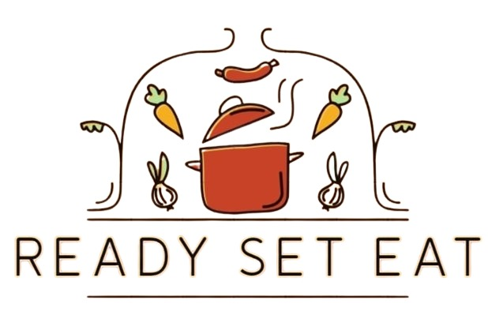
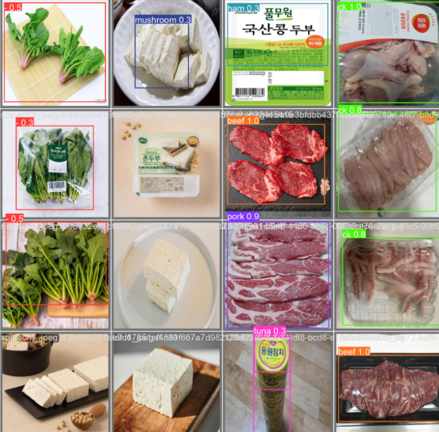
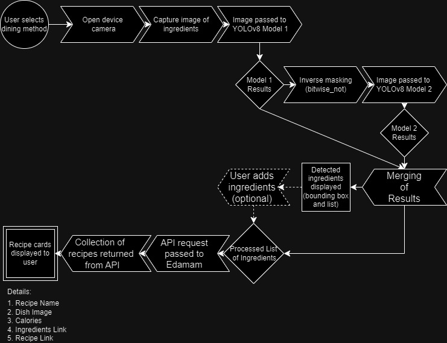

# Ready Set Eat

This project aims to answer "What would you like to eat today?"  or "What should I make today?" We tried to answer this question by creating RSE (Ready. Set. Eat). 

	

RSE works in a two-part project. 
The first part is a Yolov8 🚀 based detection model. This detects all ingredients either raw or packaged, that exist in someone's pantry or fridge. 

The second part runs on an Edamam API. This part takes the detected labels from the previous part and forms a list. This list will then retrieve recipes using these ingredients. We also created a web interface for the user to interact with (prototype UI). The retrieved recipes also return with the macros based on the user profile!

We have also created a login page for users to add their information and any details about their dietary preferences. This includes allergens and macro goals. Once this information is added in the retrieved recipes take into account all particulars before retrieval. 

Below is our methodology and the flow of events when a user interacts with the system. 

